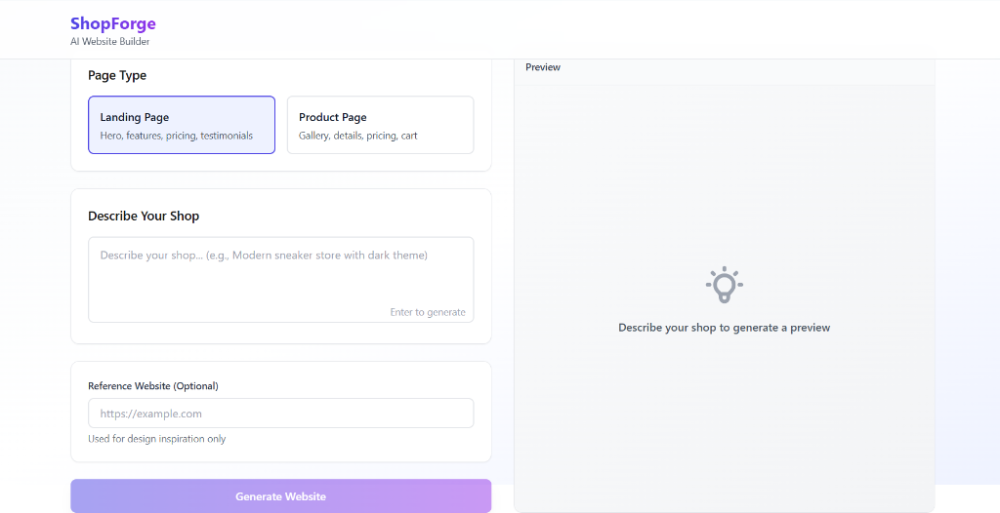
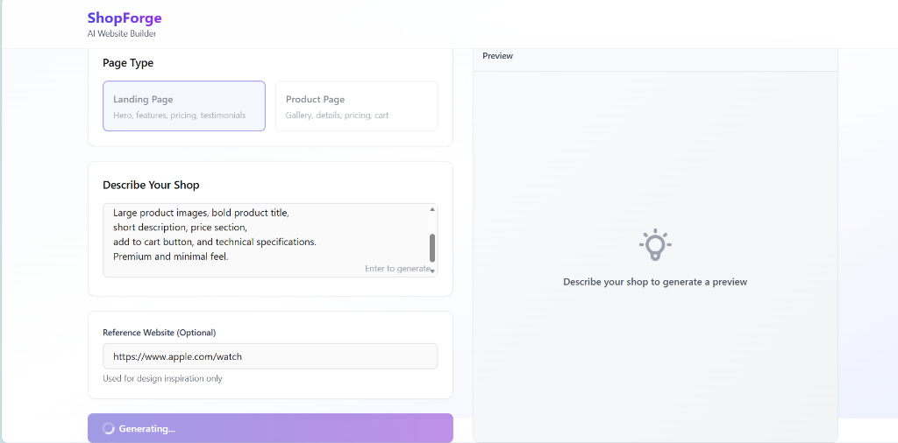
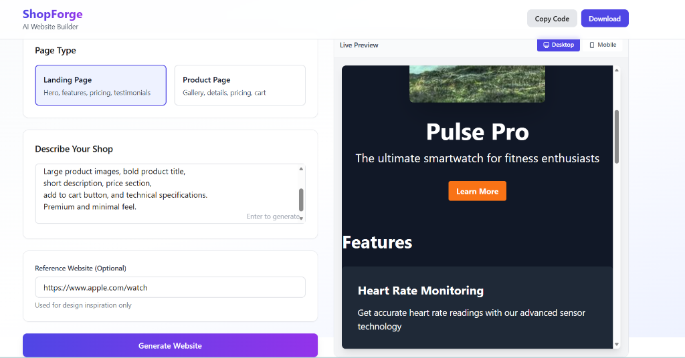
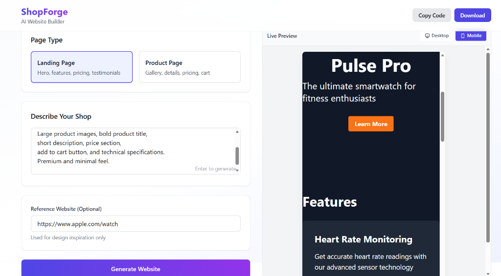

# ShopForge 🛍️

**AI-Powered Website Generator** - Transform your shop description into a complete Next.js website in seconds.

[](https://nextjs.org/)
[](https://www.typescriptlang.org/)
[](https://tailwindcss.com/)
[](https://groq.com/)

---

## 🎯 What is ShopForge?

ShopForge is an AI-powered website generator that creates production-ready Next.js websites from natural language descriptions. Simply describe your shop, select a page type (Landing or Product), and watch as AI generates a fully-functional, responsive website with modern design.

**Key Features:**
- 🤖 **AI-Powered Generation** - Uses Groq's Llama 3.3 70B model
- 📱 **Responsive Preview** - Desktop/mobile viewport toggle
- 💾 **Code Export** - Copy or download generated code
- 🎨 **Modern Design** - Tailwind CSS with gradients and shadows
- ⚡ **Real-time Preview** - Live iframe rendering with Babel transpilation

---

## 🚀 Quick Start

### Prerequisites

- Node.js 18+ 
- npm or yarn
- Groq API key ([Get one free](https://console.groq.com/))

### Installation

1. **Clone the repository**
```bash
git clone https://github.com/nikhil060504/ShopForge.git
cd ShopForge
```

2. **Install dependencies**
```bash
npm install
```

3. **Set up environment variables**

Create a `.env.local` file in the root directory:
```env
GROQ_API_KEY=your_groq_api_key_here
```

4. **Run the development server**
```bash
npm run dev
```

5. **Open your browser**
```
http://localhost:3000
```

---

## 🛠️ Tech Stack

### Core Framework
- **Next.js 14** - React framework with App Router
- **TypeScript** - Type-safe JavaScript
- **React 18** - UI library

### Styling
- **Tailwind CSS** - Utility-first CSS framework
- **Custom Gradients** - Modern visual design

### AI Integration
- **Groq API** - Ultra-fast LLM inference
- **Llama 3.3 70B Versatile** - Production model
- **groq-sdk** - Official Node.js SDK

### Preview System
- **Babel Standalone** - Client-side JSX transpilation
- **React UMD** - CDN-based React runtime
- **iframe Sandboxing** - Isolated preview rendering

---

## 🎨 Design Decisions

### 1. **Why Groq over OpenAI?**
- **Speed**: Groq's LPU delivers 10x faster inference than GPUs
- **Cost**: More affordable for high-volume generation
- **Quality**: Llama 3.3 70B matches GPT-4 quality for code generation

### 2. **Client-Side JSX Compilation**
Instead of server-side rendering, we use Babel Standalone in the browser:
- **Faster iteration**: No server roundtrip for preview updates
- **Simpler architecture**: No complex build pipeline
- **Better UX**: Instant preview updates

### 3. **Component-Only Output**
AI generates pure React components without imports/exports:
- **Cleaner prompts**: Simpler instructions for AI
- **Better reliability**: Less chance of syntax errors
- **Easy wrapping**: We control the runtime environment

### 4. **Tailwind-Only Styling**
Enforced Tailwind CSS with validation:
- **Consistency**: All generated code follows same patterns
- **CDN-friendly**: Works with Tailwind CDN in preview
- **Modern**: Gradients, shadows, responsive utilities built-in

### 5. **Human-Written Code Style**
Intentionally made code look less "AI-generated":
- Casual variable names (`raw`, `clean` vs `rawCode`, `cleanedCode`)
- Lowercase error messages
- No verbose comments
- Natural code patterns

---

## 📁 Project Structure

```
ShopForge/
├── app/
│   ├── api/
│   │   └── generate/
│   │       └── route.ts          # Groq API integration
│   ├── dashboard/
│   │   └── page.tsx               # Main UI
│   ├── layout.tsx                 # Root layout
│   └── page.tsx                   # Home redirect
├── components/
│   ├── chat/
│   │   └── ChatInput.tsx          # Description textarea
│   ├── controls/
│   │   ├── PageTypeSelector.tsx   # Landing/Product toggle
│   │   └── ReferenceInput.tsx     # Optional URL input
│   ├── preview/
│   │   └── PreviewFrame.tsx       # Live preview with viewport toggle
│   └── ui/
│       ├── Button.tsx             # Reusable button
│       └── CodeExport.tsx         # Copy/download functionality
├── lib/
│   ├── aiPromptBuilder.ts         # Constructs AI prompts
│   ├── codeSanitizer.ts           # Cleans & validates AI output
│   └── previewUtils.ts            # Wraps code for iframe rendering
├── types/
│   └── generation.ts              # TypeScript interfaces
└── public/                        # Static assets
```

---

## 🔧 How It Works

### 1. **User Input**
- Describes their shop in natural language
- Selects page type (Landing or Product)
- Optionally provides reference URL

### 2. **Prompt Construction**
```typescript
// lib/aiPromptBuilder.ts
- Adds required sections based on page type
- Enforces Tailwind CSS only
- Specifies exact output format
```

### 3. **AI Generation**
```typescript
// app/api/generate/route.ts
- Calls Groq API with llama-3.3-70b-versatile
- Temperature: 0.7 (balanced creativity)
- Max tokens: 3000
```

### 4. **Code Sanitization**
```typescript
// lib/codeSanitizer.ts
- Strips markdown fences
- Removes imports/exports
- Validates structure
```

### 5. **Preview Rendering**
```typescript
// lib/previewUtils.ts
- Wraps code in HTML document
- Loads React from CDN
- Babel transpiles JSX in browser
- Renders in sandboxed iframe
```

---

## 🖼️ Screenshots

### Dashboard Interface
The clean, intuitive interface for describing your shop and generating websites.



### AI Generation in Action
Watch as AI generates your website in real-time.



### Generated Product Page (Desktop)
Fully responsive product page with modern design, generated from a simple description.



### Generated Landing Page (Mobile)
The same generated code looks perfect on mobile devices.



---

## 🌟 Features in Detail

### AI Prompt Engineering
- **Section Requirements**: Enforces all necessary page sections
- **Design Instructions**: Modern aesthetics with gradients/shadows
- **Output Control**: Exact format specification prevents errors
- **Iteration Support**: Can refine existing code

### Preview System
- **Desktop Mode**: Full-width responsive preview
- **Mobile Mode**: 375x667px iPhone viewport
- **Live Rendering**: Updates instantly on generation
- **Error Handling**: Catches and displays runtime errors
- **Sandbox Security**: `allow-scripts allow-same-origin`

### Code Export
- **Copy to Clipboard**: One-click copy
- **Download as File**: Saves as `generated-page.tsx`
- **Ready to Use**: Drop into any Next.js project

---

## 🚧 Known Limitations

1. **Single Component**: Generates one page at a time
2. **No State Persistence**: Code is lost on refresh
3. **Limited Refinement**: Basic iteration support
4. **Groq Rate Limits**: Free tier has request limits

---

## 🔮 Future Enhancements

- [ ] Multi-page generation
- [ ] Project export (full Next.js structure)
- [ ] Code history/versions
- [ ] More page types (About, Contact, Blog)
- [ ] Custom component library
- [ ] Style customization
- [ ] Database integration templates

---

## 🤝 Contributing

Contributions are welcome! Please follow these steps:

1. Fork the repository
2. Create a feature branch (`git checkout -b feature/amazing-feature`)
3. Commit your changes (`git commit -m 'Add amazing feature'`)
4. Push to the branch (`git push origin feature/amazing-feature`)
5. Open a Pull Request

---

## 📝 License

This project is open source and available under the [MIT License](LICENSE).

---

## 🙏 Acknowledgments

- **Groq** - For lightning-fast LLM inference
- **Meta** - For Llama 3.3 open-source model
- **Vercel** - For Next.js framework
- **Tailwind Labs** - For Tailwind CSS

---

## 📧 Contact

**Nikhil** - [@nikhil060504](https://github.com/nikhil060504)

Project Link: [https://github.com/nikhil060504/ShopForge](https://github.com/nikhil060504/ShopForge)

---

Made with ❤️ using AI
